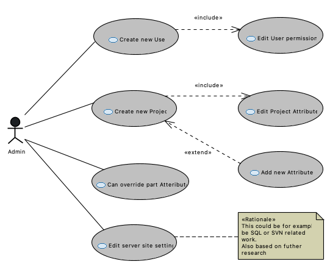
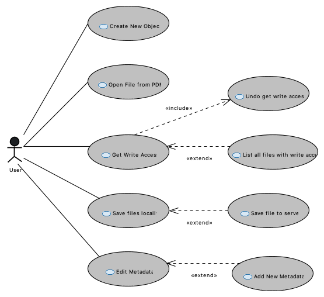

# FreePDM
***Concept Of Design***

## Workflows

### Administrators

- Create new users
  - Edit user permissions
- Create new projects
  - Edit project Attributes
- Can override Part attributes(related to its state)
- Edit Server side settings

### Users

- Open File from pdm
- Get write Access (Check-out)
  - List all files with write access
- Save file locally
- Save file to server (Check-in)
- Edit Metadata
  - Add (new) Metadata
- Create new part.

### Stories

Add link to files

[<< Previous Chapter](FreePDM_01-RequestedInformation.md) | [Content Table](FreePDM_00-CoD.md) | [Next Chapter >>](FreePDM_03-DesignDecisions.md)
