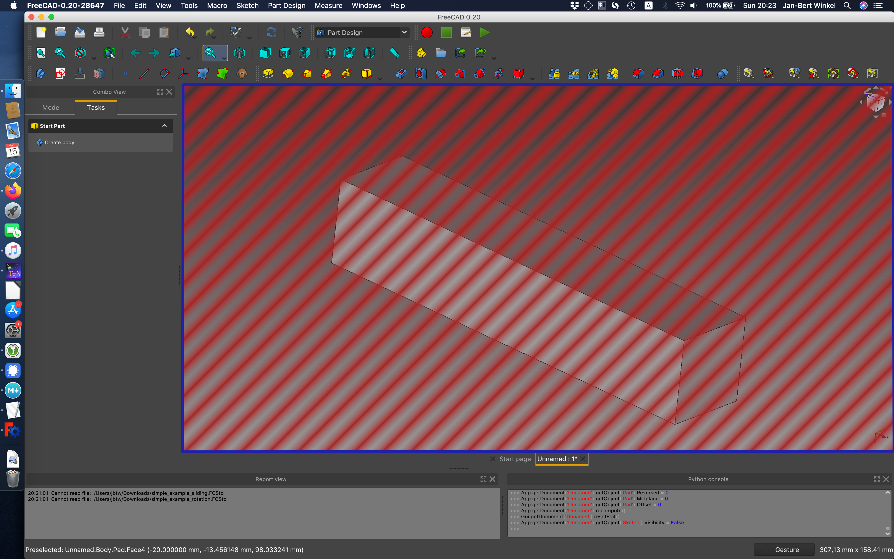
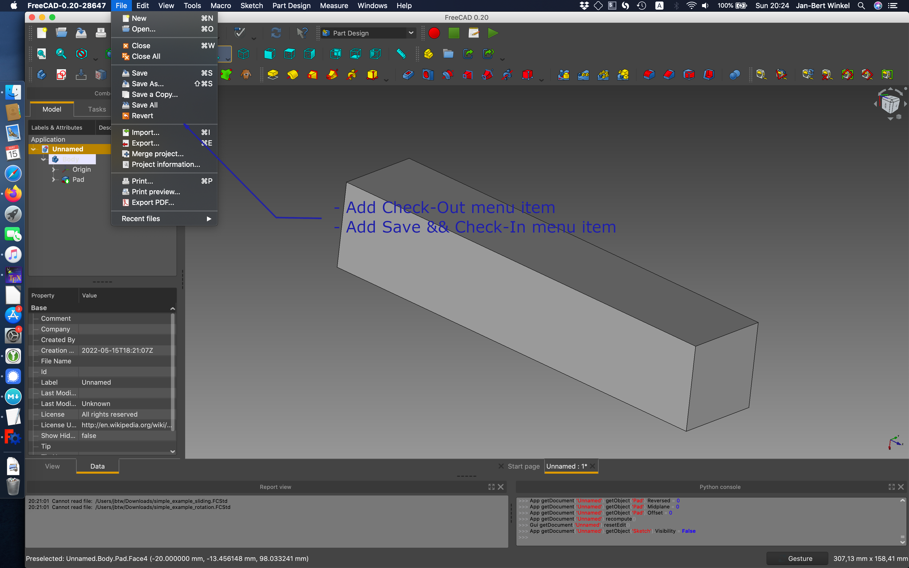
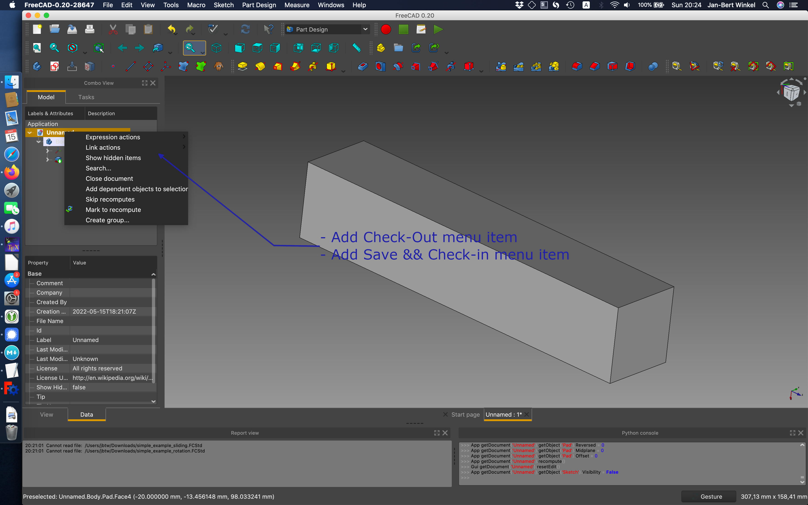

# FreePDM
***Concept Of Design***

## Ui interacting with FC

### Introduction

Before in @link there is is spoken about the methods that should be added from the gui.
This one goes more about the interaction between [FreeCAD](https://freecadweb.org) and the PDM system.

### Assumptions

- The PMD should take in rest(not active use) as few as possible screen space
- It should be easy to open the PDM system
- The PDM system should be able to open basically from every workbench.

### Workflow 1

In freeCAD there is (via Qt) a build in Webkit. Just like the start WB build a 'local' webpage who interact with the server.  
It is possible top make use of these webkit to send requested information about 

- searching,
- projects, 
- info from parts in current project
- etc
- see: [04-UIFunctions](04-UIFunctions.md)

In a tabblad there is plenty of space to process this type of information.

### questions / Comments 1

- The webkit is harder to use when there is interaction needed between the FC App and the pdm
- If the tabblad closes there should be a method to get it back

### Workflow 2

FreeCAD have a Add-on system available. By default all Add-ons are written in python.
By Creating an add-on there is probably more option for interaction between FreeCAD and the pdm compared to a strictly _web interface_.
On the other hand the amount of complexity can also be bigger.
Besides the same actions as [workflow 1](#workflow-1) there are other options like the workflows [4](#workflow-4) and [5](#workflow-5)

- see: [04-UIFunctions](04-UIFunctions.md)

#### questions / Comments 2

### Workflow 3

The last option is a hybrid method where there is some stuff done using the webkit (or comparable method).
Also there is a part of the workbench that should work with the Tooling that is added using the Add-on manager

#### questions / Comments 3

### Workflow 4

The rationale behind why the Check-In, Check-Out buttons are added to the filemenu is easy.
The File Menu is alway there.
Another option is make a dedicated menu for _All_ pdm functionality, the question is, is that required.

#### questions / Comments 4

- Is for this feature a dedicated add-on module required?
- How to handle workspaces? (If this feature needs implementation probably a add-on is **required**)
  - When opening a file how does FC point to the right workspace?
  - Is it possible to change from workspace while i file is open?
  - ...

### Workflow 5

Basically this feature is partly duplicate with workflow 4 but for some users this feels more natural.

#### questions / Comments 5

- Is for this feature a dedicated add-on module required?