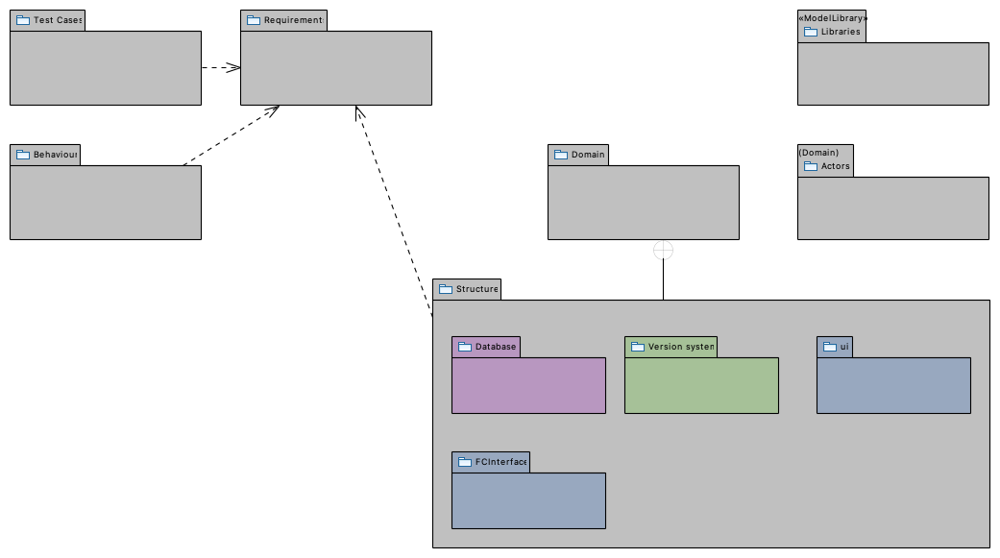
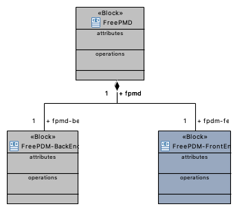
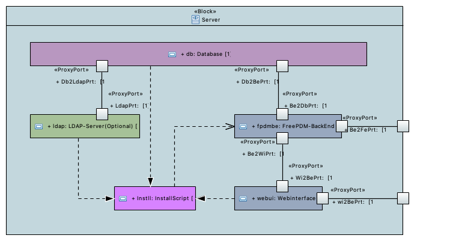
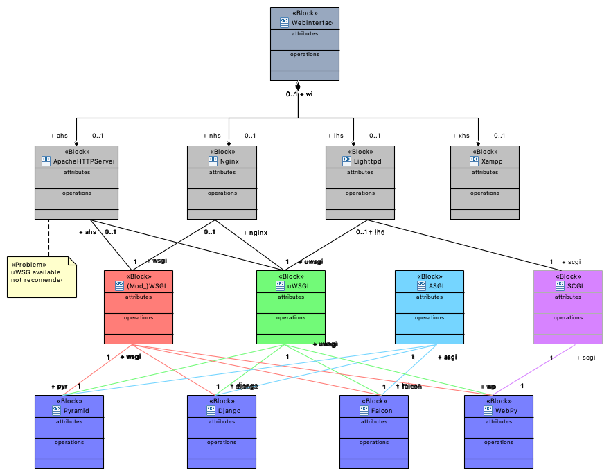
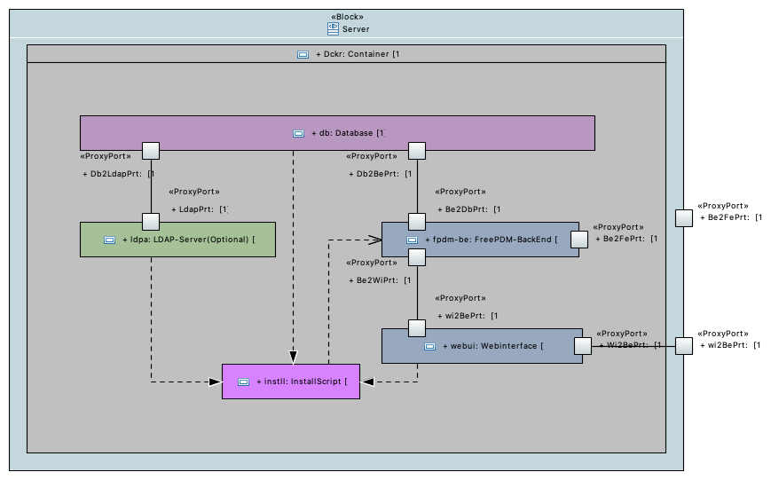

# FreePDM
***Concept Of Design***

## System Architecture

### Hierarchy

<!-- Version of figure partly outdated -->

The hierarchy is described from left top to right bottom.

The Test cases are currently a set of CAD-files so that are needed to test the behaviour of reading properties from it.
Other behaviour is mainly described in the workflows that are worked out in the [workflows](FreePDM_02-Workflows/) folder.  
Both depends on the requirements.

Right in the top are the libraries. In this case Software Libraries.

Second row in the middle there is the domain.
The domain is where where the system acts in.
Part of the domain is are the actors(This can be other systems but also persons).
Another part of the system is the structure (of the system).  
Inside the system there are some (potential )sub systems.
Be aware that within this context the Ldap-server is part of the Version system.

### General system

Beside the side packages FreePDM is spit between a _Frond-End_ system and a _Back-End_ system (See image above).
The _Frond-End_ is installed on the _Client-PC_, while the _Back-End_ is installed on the Server(see image below). 

### server side

Currently the Server is an abstract object. 
It can be:

- A physical Device
- A virtual Machine
- A container
- A combination from above

For a more _Container_ like environment see: [_Container_](#Container-(Optional))

One of the requirements is that it should be possible to run a server without / With al limited amount of extra hardware.
Of course this holds only for small environments!
For a few user this should be work in a Virtual machine or a Raspberry Pi_ but for more users this is probably not powerful enough!  

An extra Item could be _Raspberry Pi_ cluster this [DIY project](https://www.raspberrypi.com/tutorials/cluster-raspberry-pi-tutorial/) or [the _Tuning Pi_](https://turingpi.com/).

#### Database - Prerequisite

The _Database_ is the only real prerequisite.
All Other Frameworks are not directly needed.

There are multiple options on what type of _Database_ is preferred.
A list of (currently )optional _Database_ can be found in the [Design Decisions](FreePDM_03-DesignDecisions).
The question with these _Database_ options is if they conflict with the webserver.

For more information about potential _Database_ tables see: [FreePDM_07-DatabaseSetup](FreePDM_07-DatabaseSetup.md)

#### LDAP-Server - Optional

Somehow the functionality of the _LDAP-server_ is difficult to grasp.
Or the idea of a _svn-server_ sounds way simpler.
Beside that it sound more easy a _svn-server_ has some drawbacks.  
Both _svn_ and _git_ aren't good in handeling _Binary_ _Data_.
Simply described they just make a copy in the background.
A _git_ / _svn_ versioning system work on project level.
So a project contain a set of _Files_ and the set of _Files_ get a certain version.
While in _CAD-Data_ it is quite common that not all _CAD_Files_ have the same version number.
That a single _File_ needs a change or even that only the _Drawing_ needs a change.

How does the _LDAP-server_ work:  
Imagine yourself that the _LDAP-server_ is a _Database_ in the form of a file structure / Folder hierarchy.
It handle User authentication on _File_ / _Folder_ level.
But is don't handle versions as what a versioning systems does.
This means the versioning part should be done between the _LDAP-server_ and the _Database-Server_

Main reason why the _LDAP-server_ is currently optionally is that it is unknown if this kind of hierarchy can be achieved from the _Database_ alone.

In [DB Versioning Update](FreePDM_03-3-DBVersioningUpd.md) is already written about the _LDAP-server_.
If you want to dive deeper you have to look there. 

#### Webserver - Currently not needed, But maybe Optional in the future

However the webserver is currently not wanted see [_Design Decisions_](FreePDM_03-DesignDecisions.md).  
If in the future there is a reason to add one.
It is good to dive into it including the set of optional solutions.  
Therefore an overview is created with the currently available (_Python_) _Web-Frameworks_ including how they potentially interact.

The colors are a bit shiny, but it is what it is.
Because all lines become a bit spaghetti like the lines of the colors are changed to the same color as the needed middleware.

##### Frame Works

[top 5 open source web servers](https://opensource.com/business/16/8/top-5-open-source-web-servers)

- [Apache http(d) server](https://httpd.apache.org/)
- [Nginx](https://nginx.org/en/)
- [Lighttpd](https://redmine.lighttpd.net/)
- [Xampp]()

##### Python frame works

A (sub)set of available python _Web Framework_s:

- [Bottle](https://bottlepy.org)
- [Django](https://www.djangoproject.com/)
- [Falcon](https://falconframework.org/)
- [Paste](https://paste.readthedocs.io/en/latest/) - [pythonpaste.org](https://pythonpaste.org) is not accessible anymore.
- [Pyramid](https://trypyramid.com/) and [Pylons Project](https://pylonsproject.org/projects.html)
- [Webpy](https://webpy.org/)

What is the best option for a _Web-Framework_?

[Is bottle suitable for complex applications?](https://bottlepy.org/docs/dev/faq.html?highlight=apache)

> Bottle is a micro framework designed for prototyping and building small web applications and services.
> It stays out of your way and allows you to get things done fast, but misses some advanced features and ready-to-use solutions found in other frameworks (MVC, ORM, form validation, scaffolding, XML-RPC).
> Although it is possible to add these features and build complex applications with Bottle, you should consider using a full-stack Web framework like pylons or paste instead.

What about [Pylons](https://pylonsproject.org/about-pylons-framework.html)? It is now pyramid

> Maintenance-only mode
>
> The Pylons web framework has merged with repoze.bfg into Pyramid, and is now in maintenance-only mode.
> You may submit a pull request or issue, then respectfully request of the maintainers to accept it and make a release.
>
> It's highly recommended that new projects start with the new merged web framework, Pyramid.

Paste has some difficulties according them selfes:

> Paste has been under development for a while, and has lots of code in it.
> Too much code! The code is largely decoupled except for some core functions shared by many parts of the code.
> Those core functions are largely replaced in WebOb, and replaced with better implementations.
>
> The future of these pieces is to split them into independent packages, and refactor the internal Paste dependencies to rely instead on WebOb.

[Webob](https://webob.org/) is part of the [Pylons Project](https://pylonsproject.org/projects.html).

Quotes from Django [install page](https://docs.djangoproject.com/en/4.0/topics/install/).

> If you want to use Django on a production site, use Apache with mod_wsgi.

<!--split quotes-->

> If you can’t use mod_wsgi for some reason, fear not: Django supports many other deployment options. One is uWSGI; it works very well with nginx. Additionally, Django follows the WSGI spec (PEP 3333), which allows it to run on a variety of server platforms.

So if using a production environment what FreePDM is meant for we should use a Apache or Nginx environment.

##### databases

What databases are supported by what environment.
First the standard _Framework_s:

- Apache - [FreeTDS, MySQL/ MariaDB, Oracle, PostgreSQL, SQLite2 / 3, ODBC](https://httpd.apache.org/docs/current/mod/mod_dbd.html)
- Nginx - Almost None Information...[postgresql](https://docs.nginx.com/nginx-controller/admin-guides/install/nginx-controller-tech-specs/#supported-postgresql-versions) (excl [third-party databases](https://www.nginx.com/resources/wiki/modules/))
- lighttpd - [dbi, ldap, mysql, or postgresql](https://redmine.lighttpd.net/projects/lighttpd/wiki/Docs_ModVhostDB)
- xampp - [MariaDB, others are unknown](https://www.apachefriends.org/index.html)

There is a big difference between the packages above.
Nginx is probably the most difficult one. Not technically but it has a difficult interaction between the open source package and the payed(don't know if it is closed source) version.
For example there is no way how to find out what _Database_ types are by default available.  
Apache, Nginx and Lighttpd have the possibility to work together with an ldap _Database_.
Bu also now it is unknown if the [Nginx](https://www.nginx.com/blog/nginx-plus-authenticate-users/) has this by default

Python _Framework_s:

- Django - [PostgreSQL, MariaDB, MySQL, Oracle, SQLite](https://docs.djangoproject.com/en/4.0/ref/databases/) (excl. [third-party databases](https://docs.djangoproject.com/en/4.0/ref/databases/#third-party-notes))
- Pyramid - [ZODB](https://docs.pylonsproject.org/projects/pyramid/en/2.0-branch/tutorials/wiki/index.html), [Alchemy](https://docs.pylonsproject.org/projects/pyramid/en/2.0-branch/quick_tutorial/databases.html)
- Falcon - None, but works via [SQLAlchemy](https://falcon.readthedocs.io/en/stable/user/faq.html?highlight=database#how-do-i-manage-my-database-connections)

Django is the only one that has direct support for one or more _Database_ types.
Pyramid and Falcon use SQLAlchemy as middle men.

##### Conclusion

When looking at the environment this can be described as a working site.
Within this context it is important that the is a state of stability. 
Currently the Apache _Web-Framework_ looks like most developed and stable _Framework_.
Nginx comes close but because there is a lot less information available it is difficult to see what state is has.  
The first choice should be Apache and adding Nginx later on as a valid alternative.

The most well developed Python Web servers are Django, Pyramid and Falcon.  
In the python environment all are equally mature.
The main difference is the size of the _Framework_.  
Pyramid and Falcon are much smaller than Django.  
[Django](https://django-auth-ldap.readthedocs.io/en/latest/) and [Pyramid](https://pyramid-ldap3.readthedocs.io/en/latest/) support a ldap system. Falcon maybe not.

##### Extra information

- [Full stack python Apache](https://www.fullstackpython.com/apache-http-server.html)
- [Full stack python Ngix](https://www.fullstackpython.com/nginx.html)
- [Full stack python Django](https://www.fullstackpython.com/django.html)
- [Full stack python Falcon](https://www.fullstackpython.com/falcon.html)
- [Full stack python Pyramid](https://www.fullstackpython.com/pyramid.html)
- [Python basics Web frameworks](https://pythonbasics.org/python-web-frameworks/)

#### Back-End

The Backend is the core of all functionality.
The Backend communicate with the _Database_, _FileSystem_ / _LDAP-Server_ (Optionally), _Web-Server_(Optionally).  
Currently there is a split between the _Front-End_ and the _Back-End_.
In short the _Front-End_ handle much the _UI_ from User Perspective. And the _Back-End_ handle much more the interaction and communication between the _Data_ / _Database_, _File_( _Version_)s, _Security_ / _Cyber Security_ and optionally _Web-Server_.

An example what the _Back-End_ does is when user needs all files that are part of an Assembly.
The _user_ call the assembly and the backend give all lower level files.

#### Install script

For the install script there are probably 3 versions needed

- Linux / OSX version
- Windows Version
- _Container_ format

For linux and OSX a _Bash_ script would be the best option.
For windows are _Cmd-Prompt_ or _PowerShell_ the options.
For the _Container_s a script need to be created that work out of the box.

#### Container (Optional)

As visible it should be possible to run FreePDM from a _Container_.
In the figure above it is just a single _Container_ however there shouldn't be a reason to run multiple _Container_s for different sub-functions.
If a container method is used it should work on Linux, OSX and Windows.
See [here](https://alternativeto.net/software/docker/) for alternatives for Docker(the most well known version).  
The _Container_s could be:

- [BitNami Application Stacks](https://bitnami.com/stacks)
- [Crane](https://github.com/InfuseAI/crane)
- [Docker](https://www.docker.com/)
- [singularity](https://sylabs.io/singularity/)

A container has some drawbacks.
When a container is stopped and a new one started there is a [risk of losing inforamtion](https://stackoverflow.com/questions/41067032/how-to-stop-relaunch-docker-container-without-losing-the-changes).
[More information](https://forums.docker.com/t/lose-data-when-docker-restarts/23018/2).

### Client side

In the ClientPC Block it is assumed that the user is a CAD user because it is the most complex case (see image below).
If the user is a project manager (who does nothing with CAD, even not viewing) he / she shall mainly check / change the (project )attributes.  
In such a case there should be a method to install FreePDM without FreeCAD.
All CAD related features are not necessary eihter so this package should be compacter as its CAD Equivalent.

For Both The _CAD_ _User_ and the _NotCAD_ _User_ there are two types of accessing the FreePDM:

- Stand Alone (Preferred Method)
- Web Interface

Both of the cases should work within / together with FC.
This is possible since FC make also use of the Qt WebEngine (for example the Start Workbench).

#### Local File Storage

The local File storage handles all files that a user need.
This are the _CAD_ Files, but also related _pdf_ files etc.
It should be possible to have multiple _Workspaces_ so that not all files are removed when another Project / test is needed.
Both the _Front-End_ and _FreeCAD_ are connected to this FileStorage.

#### Frond-End / FreeCAD Add-On

The _Frond-End_ and the _FreeCAD_ _Add-On_ are the same in this case.
A big part of the _Front-End_ handles Files So downloading the Files from the server.  
An extension of the example in [Back-End](#back-end).
A user has called an Assembly and Downloaded that one in his (Brand new)_Workspace_. He Opens the file from the _Front-End_ it should automatically download all required files in his _Workspace_.  
More information about workflows can be found in [UIInteractionFC](FreePDM_02-Workflows/05-UIInteractionFC.md).

#### FreeCAD

Within _FreeCAD_ Some functionality need to be added so that the files can be _Checked-In_ or _Checked-Out_ from a _Menu_ or a _FileObject_.  
On the other hand _FreeCAD_ Needs Acces to the File location, without any interactions between the different workspaces!

[<< Previous Chapter](FFreePDM_04-Requirements.md) | [Content Table](README.md) | [Next Chapter >>](FreePDM_05-1-DatabaseSetup.md)
