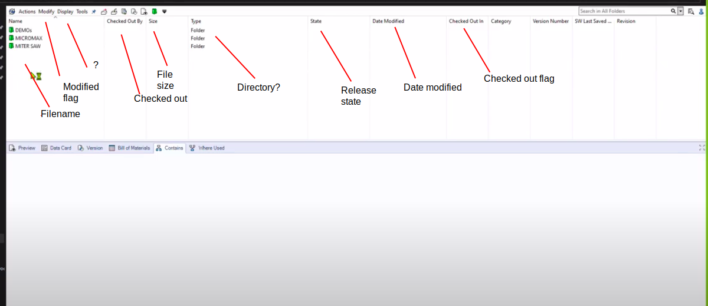
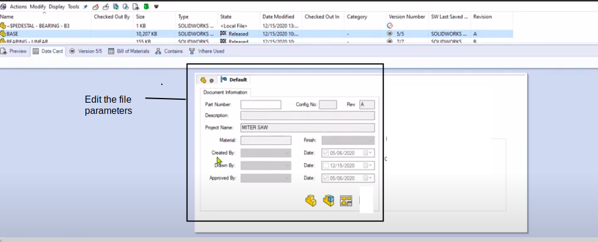

# FreePDM
***Concept Of Design***

## Roadmap(s)

### Research and Conceptual Design

- [ ] Define information about
  - [x] Define need info(in what term)
  - [x] Define work environment
  - [x] Define workflows(how to’s)
  - [ ] Define programming Language == Python
- [x] Create a set of sample files
- [x] Developing Requirements
- [x] Get and set features out of requirements

### Development Short term

- [ ] Create Database
- [ ] Create Fileserver
- [ ] Create Installer
  - [ ] Able to install on VM
  - [ ] Able to install in Container 
- [ ] Add Testdata to Database
- [ ] Add Testdata to FileServer
- [ ] Request Write Access _Database_
- [ ] Request Write _File_
- [ ] Start extension mechanisms

### Development Medium term

- [ ] Create User Functions
  - [ ] Create New Item
  - [ ] Modify Item
  - [ ] Delete New Item
  - [ ] Create New / Local File
  - [ ] Modify File
  - [ ] Delete New File
- [ ] Create Admin Functions <!-- an admin page (see the main readme page) -->
  - [ ] Add User
  - [ ] Add Role
  - [ ] Change Role
  - [ ] Create Role
  - [ ] Delete existing Item
  - [ ] Delete existing File( from Database)
  - [ ] Add Attribute Item
  - [ ] Add Attribute File
  - [ ] Add User Permissions
  - [ ] Change User Permissions
- [ ] Handle File, Item Change
  - [ ] Handle Item on User Permissions
  - [ ] Handle Item on Item Activity
  - [ ] Handle item on Item State
  - [ ] Handle File on User Permissions
  - [ ] Handle File on Item Activity
  - [ ] Handle File on Item State 
- [ ] Handle States
  - [ ] Example from work to Revision
  - [ ] Example from Revision to work
- [ ] Define the user group
- [ ] Define What features are in what state
- [ ] Developing extension mechanisms

### Development Long Term

- [ ] Handle Local File Storage(s)
  - [ ] Data Download via UI
  - [ ] Data Download via FC
  - [ ] Compare Data with Server UI
  - [ ] Compare Data with Server FC
- [ ] Create Project Features
  - [ ] Create New Project
  - [ ] Delete Empty Project
  - [ ] Authenticate User to Project
  - [ ] Modify Project Attributes
  - [ ] Modify Project Hierarchy
  - [ ] Request Project Access UI
  - [ ] Request Project Access FC
- [ ] Create Admin Functions
  - [ ] Delete existing Project
- [ ] Duplicate File
  - [ ] Duplicate File local
  - [ ] Duplicate File on Server
- [ ] Duplicate Assembly Structure
  - [ ] Option to duplicate lower level files 
- [ ] Store the output into files
- [ ] Create feature tree
- [ ] Create BOM list from (File)hierarchy

### Continue Development Cycles

- [ ] AuthenticateUserFile
- [ ] RequestWriteAccessUI
- [ ] RequestWriteAccessFC
- [ ] OpenLocalDataUI
- [ ] OpenLocalDataFC
- [ ] AddAttributeFromCADWeight
- [ ] AddAttributeFromCADMaterial
- [ ] AddAttributeFromCADAssemblyType

For information about how to store deal with the data, there are three figures to look at.
- 
- 
-  

[<< Previous Chapter](FreePDM_05-1-DatabaseSetup.md) | [Content Table](README.md) | [Next Chapter >>](FreePDM_07-TestFiles.md)
