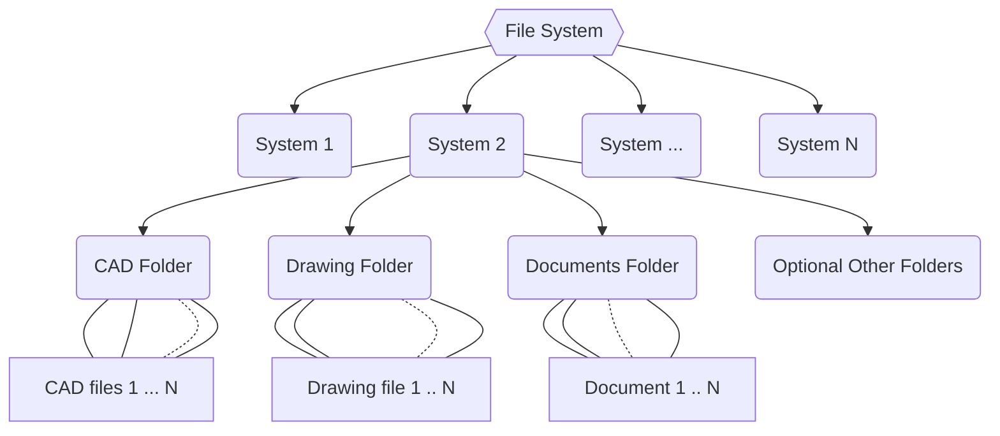
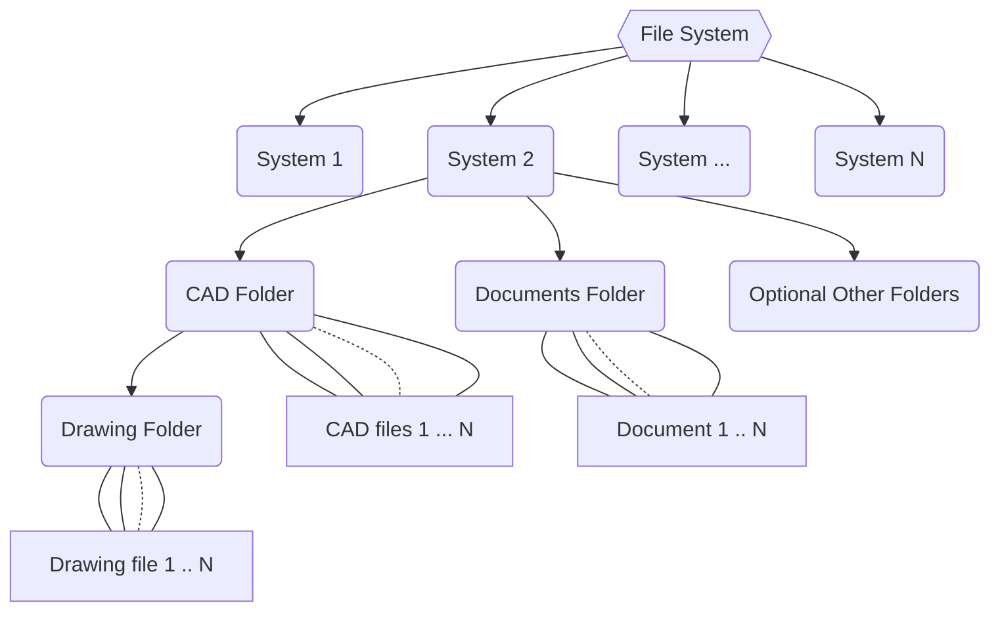
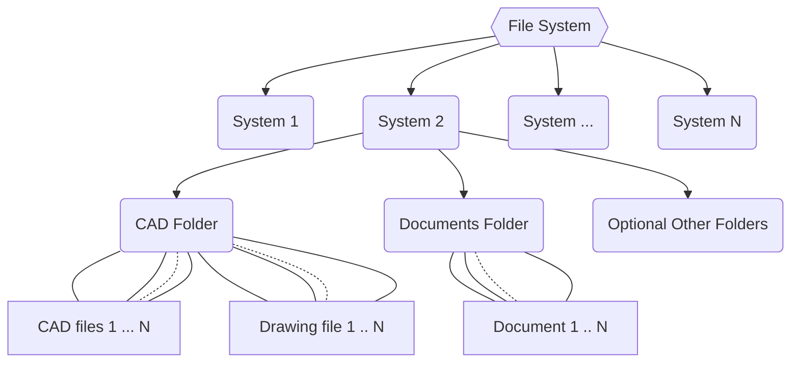
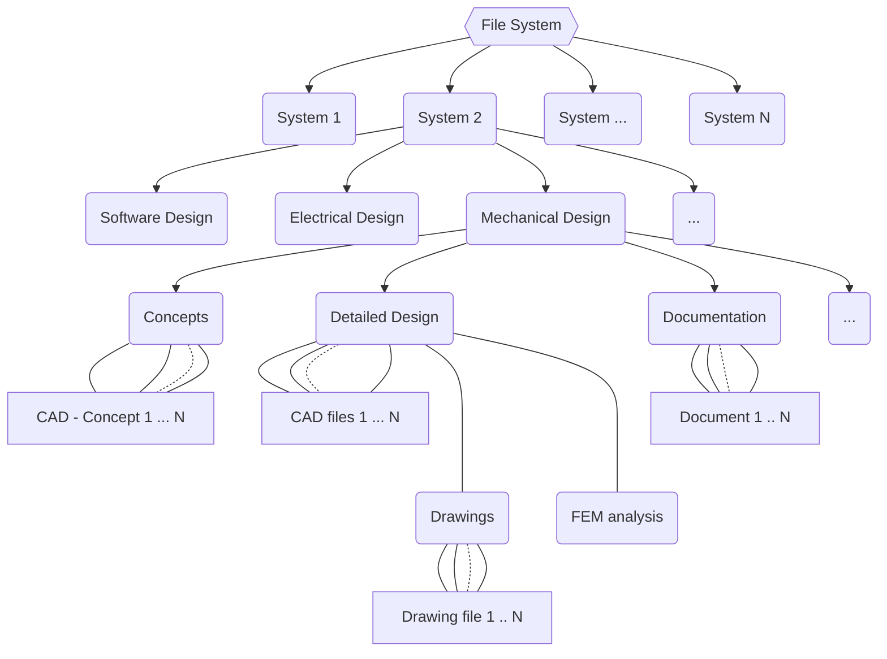

# FreePDM
***Concept Of Design***

## Version workout

### Example Project

Let's assume this is a (part of a) structure breakdown of a basic automobile. The system consists of five sub-systems namely:

- Chassis (_SubSystem1_)
- Drivetrain (_SubSystem2_)
- Body (_SubSystem3_)
- Entertainment (_SubSystem4_)
- SafetySystem (_SubSystem5_)

The Engine is from an external supplier. The body of the car is brokendown further into multiple body work items.  
Below them there is the breakdown in single parts.  

### Mechanical project structure

_Note: The circle with the plus in the diagram means that site with the symbol is owner of the other side. Simple example: The chassis is part of the car and so the car is owner of the chassis._  
It is expected that most Mechanical engineers have a (project)tree in mind (as above). Probably because project managers work with that methodology (work structure breakdown) and also dut to it following a kind of Assembly hierarchy as shown at the top.  
This in reverse is also how the authorisation is. The authorisation starts at the bottom parts / assemblies / modules. Then it works upward.
A simple example: the drivetrain can't be authorised when the engine isn't ready, and the engine can't be authorised when the motor computer isn't finished.  

Another point is that every item in the model tree needs to be authorised to have a (revision) state. In addition every item needs a revision number. Note: during the project the revision number of items can diverge.

### SVN Project structure

To get a system such as SVN working as a PDM system, where every item has its own history, and its own data.

- db information
- part file / Assembly file (Optional drawing since it could be part of the part / assembly file)
- image (graphical representation inside the pdm system)

extra documentation

- FEM analysis file (Also Fem Analysis Document)
- Specification from manufacturer(s)
- Calculation(s)
- Test documentation (optional analysis files)
- Other documents 

There could be two optional schemas for a divining access to an item / folder:

1. One *folder* with everything inside it
2. One folder for each number (see above), so that it is grouped

Option 1 is the simplest, every file belonging to the project is in one single folder.
Everybody that works on the project has read-access to that folder.
Every item that needs a change has to go from read-only to write-access. When someone is making a change, other users can't edit that resource (although they can still open/read it).  

Option 2 designates every number its own SVN project. 
This way read/write access can be provided to a single project. And in turn, speeds-up access to resources as opposed to blocking the whole folder for write access (even if the goal is to only edit a single file). This takes (it is an assumption, yes) probably less overhead than giving write-acess to every individual file as in the single folder (option 1) scenario.  
Finally it is possible to work with a folder for every number AND read / write access for every file.

_Note: The more I write down about how I think it should work the more I doubt if I'm wrong.
Maybe a folder structure as it is mechanical workout too (compared to method 1). But somehow it feels more complex._

A addition based on the SVN figure.
There is a arrow pointing from _new update_ to _ProjectCar_ what i meant is that when a new project started it can depend on a previous project. And in that way take over (a part of its )structure.

#### Access control

I add a few links to questions / information about svn related to permissions, read / write access, security and file locking.

- [setup access](https://stackoverflow.com/questions/81361/how-do-i-set-up-access-control-in-svn)
- [Read only user](https://stackoverflow.com/questions/282018/single-read-only-user-for-svn)
-  [Security settings](https://stackoverflow.com/questions/1400708/svn-with-apache-security)

Extra info about [file locking](https://www.thegeekstuff.com/2014/07/svn-lock-unlock-examples/) see also [discussion topic](https://forum.freecad.org/viewtopic.php?p=594392&sid=9b31b19f572ae66342daab88ffe958d2#p594392)

### Does this also work in git?

To answer the question directly, no, not everything will work in plain git.  
Read-only is possible and yet does add more complexity than with SVN. File-locking is not possible with plain git. With git large file storage (LFS) option it is possible and is especially helpful with (partly) binary files like FCStd files, DOCX files, etc...
I added another topic that looks like a bit more an issue to git than SVN and that is private git servers.

- [Git Access control](https://wincent.com/wiki/Git_repository_access_control)
- [git read-only](https://stackoverflow.com/questions/1662205/how-to-make-a-git-repository-read-only)
- [read only chmod](https://stackoverflow.com/questions/9159453/git-repository-with-read-only-permissions)
- [individual file locking git](https://stackoverflow.com/questions/13662255/is-there-a-way-to-lock-individual-files-or-directories-on-fork-when-using-git)
- [Private git](https://www.digitalocean.com/community/tutorials/how-to-set-up-a-private-git-server-on-a-vps)

### _Update during development 2022-10-06_

The info above describe the project and the effect it have on the creation of a system.
A project can be there for the creation of a system.
But the creation of a system can exist out of multiple projects.  
When implementing projects what has to be added to regarding project management etc?
So the combination of those arguments made that the design of this system changes.
The project level will be **replaced** by a system level regarding file storing.
Of course there are points where systems are stacked above each other / are designed by another developer.
There should be thought how the CAD files could be retrieved and used later on!  
Projects are not removed completely because there is some need for ECN numbers, roles during the release process etc. **The main point is there is no dedicated project management tools inside it!**

#### File system

There are three file systems that should be supported. All depended on the preferred workflow.  
These are shown below.

<!--@Kunda1 thanks for pointing to mermaid-->
**Separated Folder for drawings:**

**Drawings Folder subfolder for CAD files:**

**Drawings added in CAD files folder:**

More complex structures could also be possible.
It is important to think how it is possible to achieve this!  
An example:

[<< Previous Chapter](FreePDM_03-1-Attributes.md) | [Content Table](README.md) | [Next Chapter >>](FreePDM_03-3-DBVersioningUpd.md)
