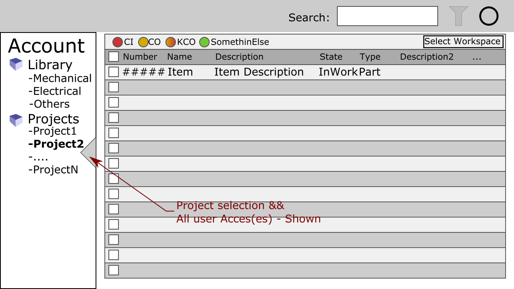
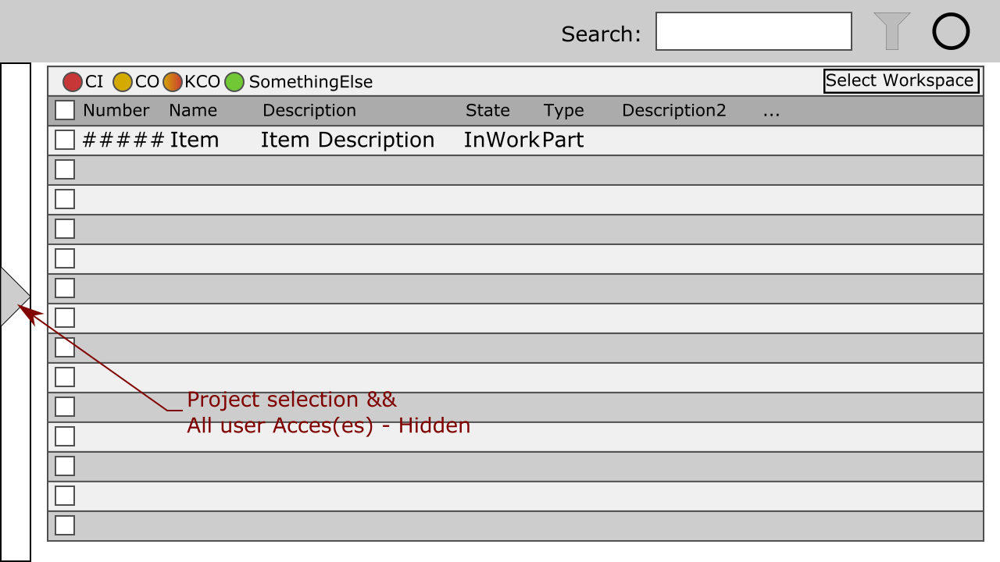
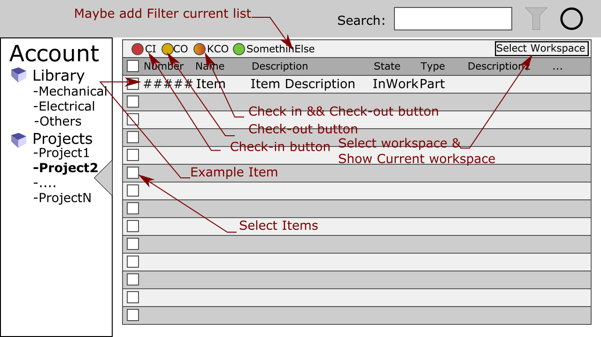
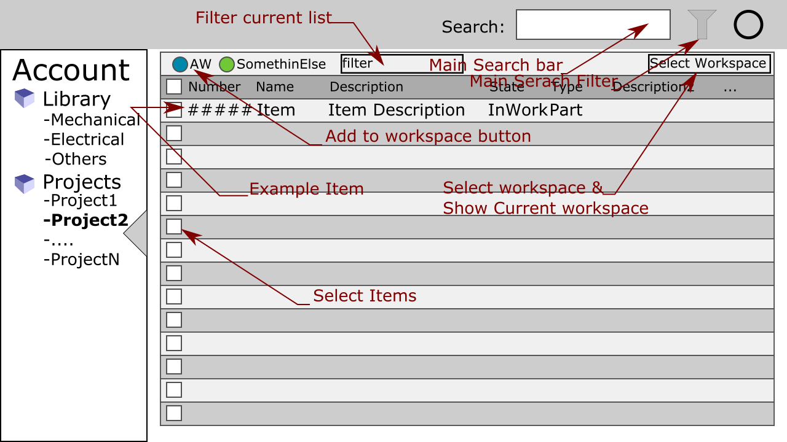
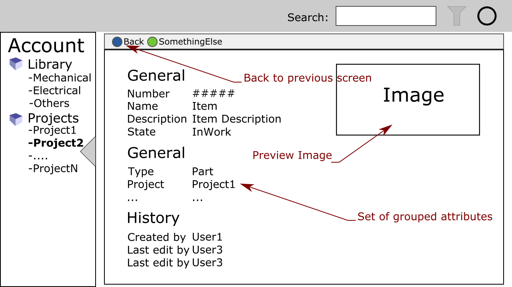
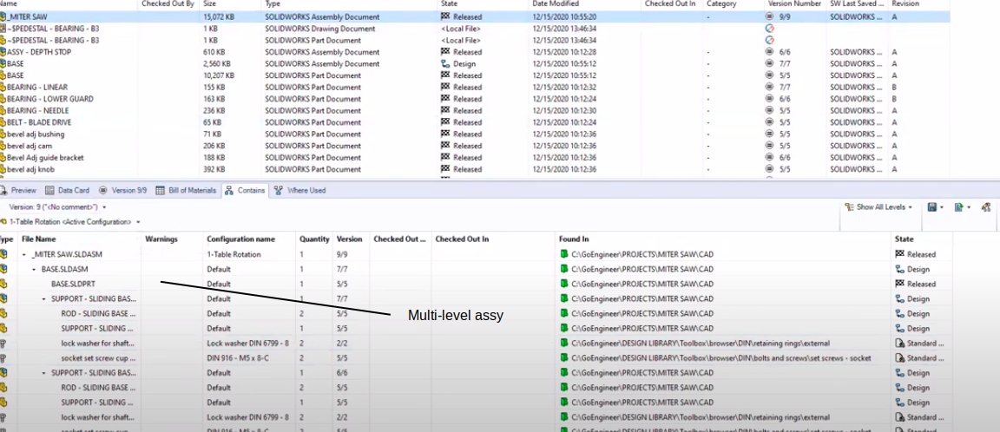
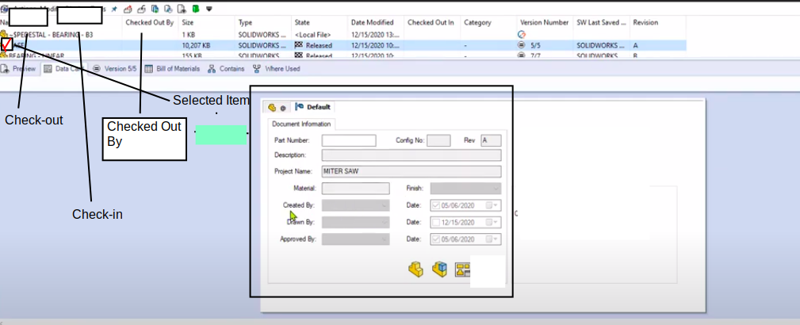
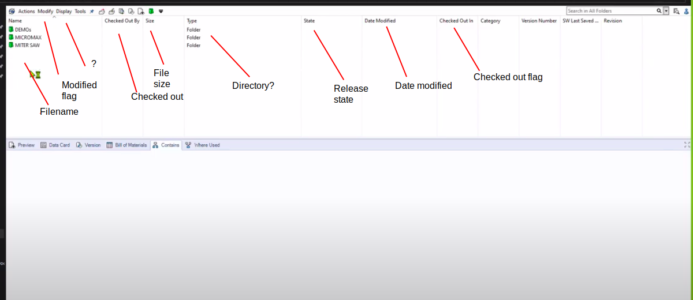
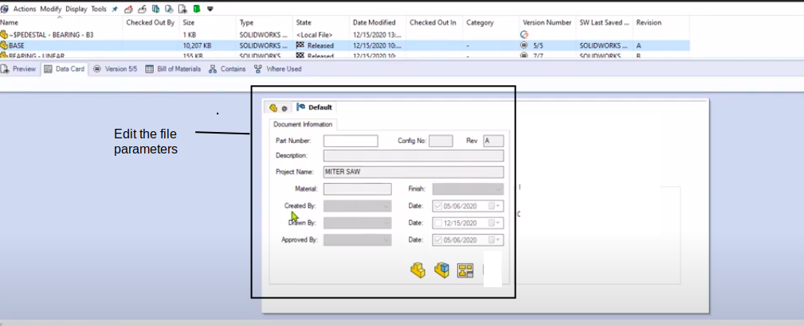

# FreePDM
***Concept Of Design***

## Ui functions

### Introduction

There are already some interfacing figures (from Solid Works). This the links to the files (in alphabetic order):

Goal: Start a discussion about how to create a set of logic workflows to handle some activities.
Also understand how different activities/workflows interact.

### Assumptions

- The PDM should take in rest as little as possible screen space ('screen real-estate')
- It should be easy to open the PDM system
- The PDM system is well integrated in FC
- The interaction inside FreeCAD see [05-UIInteractionFC](05-UIInteractionFC.md)

### Workflow 1 <!-- Project view -->

In the Project it is possible to select current working project (especially when workspaces are not implemented).
Another feature about this is that one can see what projects they have reading access to.
The project bar is hide-able.

### questions / Comments 1

### Workflow 2 <!-- Workspace view -->

The view where the most activity is done is the _Workspace_ view.
This is where all files that are in one's working directory are listed. 
When workspaces are available it is possible to create multiple workspaces from the same project or assembly. For example when you need to test something for a future change without breaking current structure.  
In this view all activities that are done happen here (at least, if not working from within FreeCAD).
The image is not complete.
A more complete list is stated below:

- Check-in
- Check-out
- undo check-out
- Check-in && check-out
- mark for revision, mark for work (revised and needs an edit again), ...
- set state (revision, obsolete, in work, ...)

Other activities

- Create workspace
  - Make copy of workspace (?)
  - Delete workspace
- Select workspace

### questions / Comments 2

Beside these functions there should be some thought dedicated to additional features like:

- an item is changed (while you don't have write access. So you can request write access)
- There is a newer version on the server
- When the main assembly is added (by a [Search action](#workflow-3)) all lower level items can be added

### Workflow 3 <!-- Search view -->

Searching is important, especially when working on bigger projects or when more (CAD-)data is available.
This is the place where item(s) are added to the workspace.

What type of search options are needed:

- name
- description
- keywords

There are two types of filtering:
**pre-filtering** and **post-filtering**.
In pre-filtering you search for a part so all assemblees with the same search term are ignored.
After the search operation, another filtering can applied.
In this case it filters in the previous find items. 
A set of filter examples are:

- project
- date / year
- number
- ...

#### questions / Comments 3

- Check if adding will be possible in (database)search

### Workflow 4 <!-- Item view -->

The last view is the item information.
Basically this is where all information from the database is displayed.  
This window can be accessed from the search view AND from the workspace view.

#### questions / Comments 4

### Images from SW

- 
- 
- 
- 

[<< Previous Chapter](03-RevisionProcedures.md) | [Content Table](README.md) | [Next Chapter >>](05-UIInteractionFC.md)
