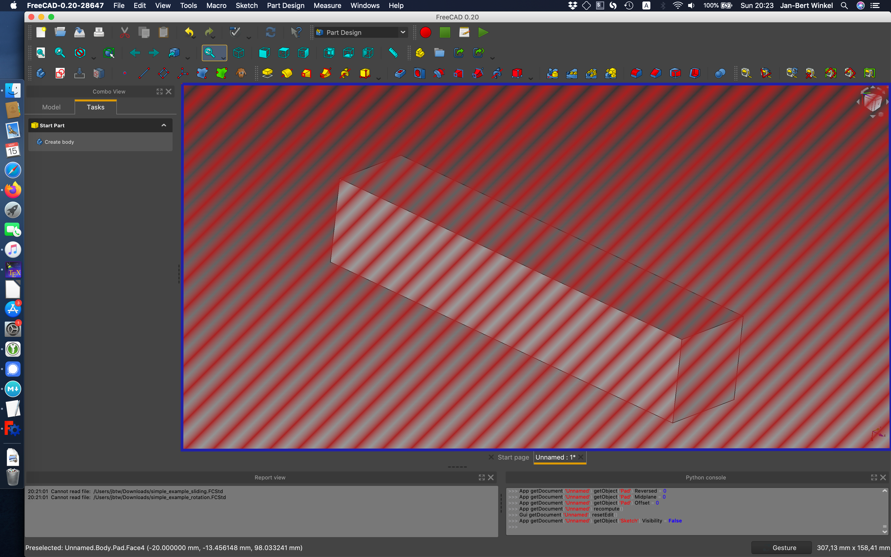
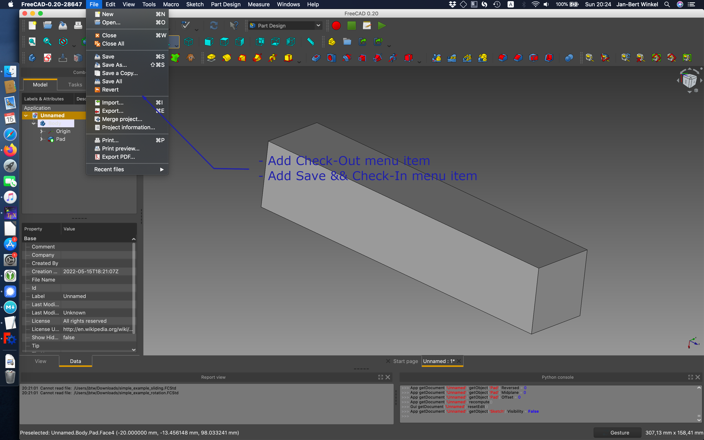
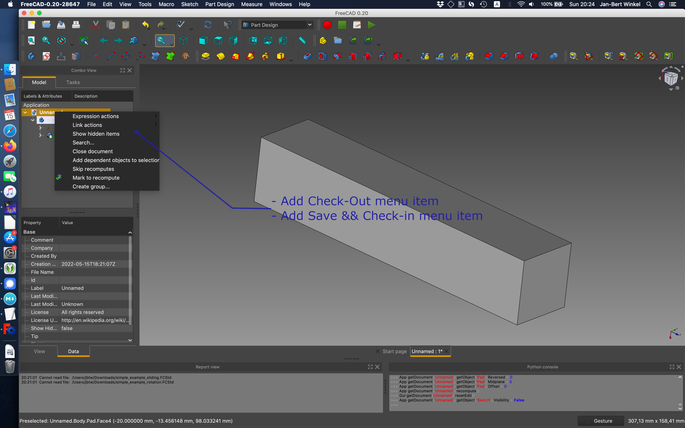

# FreePDM
***Concept Of Design***

## Ui interacting with FC

### Introduction

Within @link it mentions methods that should be added from the GUI.
Lets review the interaction between [FreeCAD](https://freecad.org) and the PDM system.

### Assumptions

- The PDM should take in rest (not active use) as little as possible screen space
- It should be easy to open the PDM system
- The PDM system should be able to open basically from every workbench.

### Workflow 1

In FreeCAD there is (via Qt) a built-in Webkit. Just as the [Start Workench](https://wiki.freecad.org/Start_Workbench) builds a 'local' webpage that interacts with a server.  
It is possible to make use of this webkit to send requested information pertaining to: 

- searching,
- projects,
- info from parts in current project
- etc
- see: [04-UIFunctions](04-UIFunctions.md)

In a tabblad there is plenty of space to process this type of information.

### questions / Comments 1

- The webkit is harder to use when there is interaction needed between the FC App and the pdm
- If the tabblad closes there should be a method to get it back

### Workflow 2

FreeCAD comes bundled with an [Add-on manager](https://wiki.freecad.org/Std_AddonMgr) system. By default all Add-ons are written in Python.
By creating an add-on there is probably more option for interaction between FreeCAD and the PDM compared to a strictly _web interface_ approach.
On the other hand the amount of complexity can also be greater.
Besides the same actions as [workflow 1](#workflow-1) there are other options like the workflows [4](#workflow-4) and [5](#workflow-5)

- see: [04-UIFunctions](04-UIFunctions.md)

#### questions / Comments 2

### Workflow 3

The last option is a hybrid method where there are some tasks done using the webkit (or comparable method).
Additionally, there is a part of the workbench that should work with the Tooling that is added using the Add-on manager.

#### questions / Comments 3

### Workflow 4

The rationale behind why the Check-In, Check-Out buttons are added to the filemenu is easy.
The File Menu is always there.
Another option is make a dedicated menu for _All_ PDM functionality, the question is, is that required?

#### questions / Comments 4

- Does this feature require a dedicated add-on module?
- How to handle workspaces? (If this feature needs implementation probably an add-on is **required**)
  - When opening a file, how does FC point to the right workspace?
  - Is it possible to change from workspace while a file is open?
  - ...

### Workflow 5

Basically this feature is partly duplicate with workflow 4 but for some users this feels more natural.

#### questions / Comments 5

- Does this feature require a dedicated add-on module?

[<< Previous Chapter](04-UIFunctions.md) | [Content Table](README.md) | [Next Chapter >>](06-DbShape.md)
